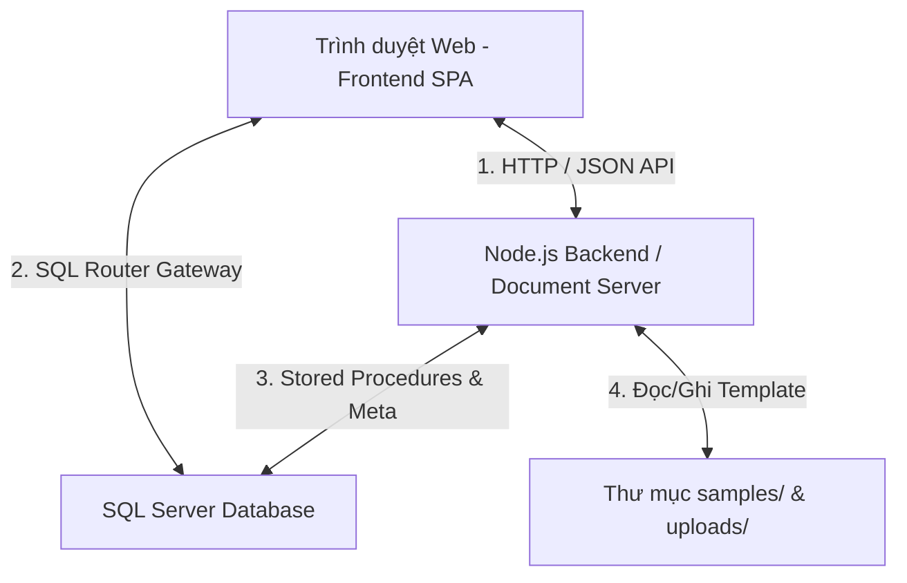
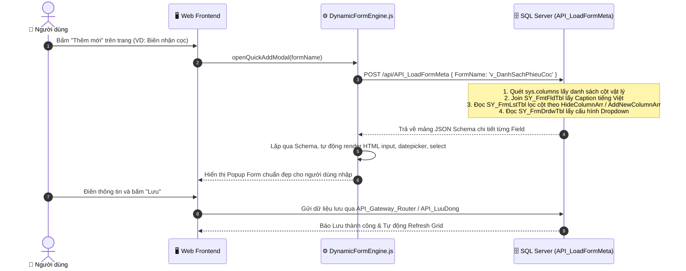
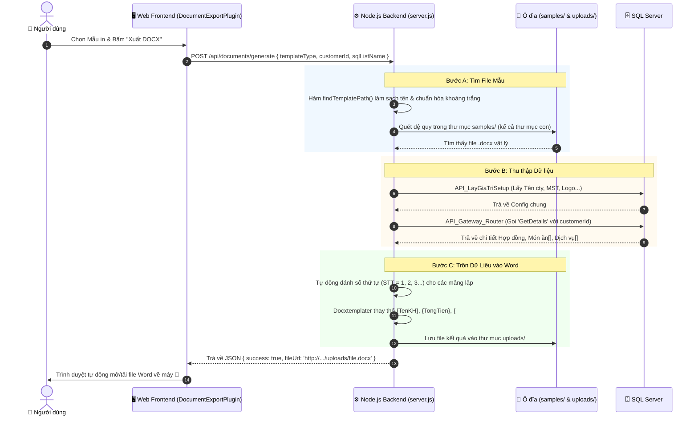

# 📖 TÀI LIỆU HƯỚNG DẪN KIẾN TRÚC & LUỒNG HOẠT ĐỘNG HỆ THỐNG
> **Dự án:** Quản lý Tiệc Cưới & Trung tâm Hội nghị (Wedding Banquet Management)  
> **Kiến trúc:** Web SPA (Frontend) + Node.js Express (Document Service) + SQL Server API Gateway (Metadata-Driven Framework)

---

## 📑 MỤC LỤC
1. [Tổng quan Kiến trúc Hệ thống (Metadata-Driven)](#1-tổng-quan-kiến-trúc-hệ-thống)
2. [Chi tiết các Bảng Hệ thống Cốt lõi (`SY_*`)](#2-chi-tiết-các-bảng-hệ-thống-cốt-lõi-sy_)
3. [Luồng 1: Dựng Form & Nhập liệu Động (Dynamic Form Engine)](#3-luồng-1-dựng-form--nhập-liệu-động-dynamic-form-engine)
4. [Luồng 2: Xuất Biểu Mẫu Hợp Đồng / Báo Cáo (DOCX Export Workflow)](#4-luồng-2-xuất-biểu-mẫu-hợp-đồng--báo-cáo-docx-export-workflow)
5. [Sổ tay Hướng dẫn Cấu hình Chức năng Mới (Dev Guide)](#5-sổ-tay-hướng-dẫn-cấu-hình-chức-năng-mới-dev-guide)
6. [Những lưu ý và Bài học Kinh nghiệm Tránh Lỗi](#6-những-lưu-ý-và-bài-học-kinh-nghiệm-tránh-lỗi)

---

## 1. TỔNG QUAN KIẾN TRÚC HỆ THỐNG

Hệ thống hoạt động theo mô hình **Hướng cấu hình dữ liệu (Metadata-Driven Architecture)**. Mọi giao diện (Form nhập liệu, Danh sách Grid, Dropdown, Mẫu in Word) đều không bị "hardcode" chết trong mã nguồn mà được điều khiển thông qua cấu hình trong CSDL SQL Server:



* **Frontend:** Tự động đọc Metadata để dựng giao diện bảng, lọc, phân trang, và form popup thêm/sửa.
* **SQL Server:** Nơi lưu trữ nghiệp vụ, dữ liệu thực tế và toàn bộ định nghĩa bảng từ điển (`SY_*`).
* **Node.js Document Server (`server.js`):** Đóng vai trò đọc template Word (.docx), gọi SQL lấy dữ liệu đơn hàng và trộn vào file Word bằng `Docxtemplater` + `PizZip`.

---

## 2. CHI TIẾT CÁC BẢNG HỆ THỐNG CỐT LÕI (`SY_*`)

| Tên bảng | Bản chất & Ý nghĩa | Vai trò trong hệ thống |
| :--- | :--- | :--- |
| **`SY_Menu`** | Quản lý cây Menu | Lưu danh sách Menu, phân cấp Cha/Con, Icon và gắn `FormName` tương ứng. |
| **`SY_FrmLstTbl`** | Cấu hình Màn hình (Form) | Định nghĩa `FormID` $\leftrightarrow$ `TableName`, Khóa chính `PrimaryKey`, danh sách cột ẩn `HideColumnArr`, cột thêm mới `AddNewColumnArr`. |
| **`SY_FmtFldTbl`** | **Từ điển Cột Toàn cục (Global Dictionary)** | Lưu ánh xạ `FieldName` $\rightarrow$ Tiêu đề tiếng Việt (`CaptionVN`) và kiểu định dạng (`FormatID`). Mỗi cột chỉ có **1 dòng duy nhất**. |
| **`SY_FmatTbl`** | Định dạng số/ngày | Quy định cách hiển thị (VD: `N0` = số nguyên, `D` = ngày tháng, `Q` = số lượng). |
| **`SY_FrmDrdwTbl`** | Cấu hình Dropdown / Select | Khai báo cột nào trên Form là Dropdown và nguồn API (`DataSource`) để lấy danh mục. |
| **`SY_Setup`** | Cài đặt chung Doanh nghiệp | Lưu Tên nhà hàng, Địa chỉ, Số điện thoại, Mã số thuế, Logo, Tên Giám đốc, Thủ quỹ... |
| **`tbmk_LoaitiecAddfile`** | Mapping File Mẫu in | Ánh xạ loại tiệc/hợp đồng với tên file Word vật lý trong thư mục `samples/`. |

---

## 3. LUỒNG 1: DỰNG FORM & NHẬP LIỆU ĐỘNG (DYNAMIC FORM ENGINE)

Khi người dùng mở một trang và bấm **"Thêm mới"** hoặc **"Chỉnh sửa"**:



---

## 4. LUỒNG 2: XUẤT BIỂU MẪU HỢP ĐỒNG / BÁO CÁO (DOCX EXPORT WORKFLOW)

Khi người dùng chọn một hợp đồng/phiếu cọc và bấm **"Xuất DOCX"**:



---

## 5. SỔ TAY HƯỚNG DẪN CẤU HÌNH CHỨC NĂNG MỚI (DEV GUIDE)

### A. Cách thêm một Màn hình / Danh mục (Form) mới:
1. **Bước 1:** Tạo Bảng hoặc View trong SQL Server (VD: `v_QuanLyKhachHang`).
2. **Bước 2:** Đăng ký vào bảng `SY_FrmLstTbl`:
   ```sql
   INSERT INTO dbo.SY_FrmLstTbl (FormID, TableName, PrimaryKey, HideColumnArr, AddNewColumnArr)
   VALUES ('frmKhachHang', 'v_QuanLyKhachHang', 'MaKH', 'CreatedDate;CreatedBy;', 'MaKH;TenKH;DienThoai;DiaChi;Email;');
   ```
3. **Bước 3:** Đăng ký Menu trong bảng `SY_Menu` (hoặc tạo từ giao diện Quản lý Menu) với `FormName = 'frmKhachHang'`.
4. **Bước 4:** Bổ sung nhãn tiếng Việt cho các cột mới vào `SY_FmtFldTbl`:
   ```sql
   INSERT INTO dbo.SY_FmtFldTbl (FieldName, CaptionVN, FormatID)
   VALUES ('TenKH', N'Tên khách hàng', 't'), ('DienThoai', N'Số điện thoại', 't');
   ```

---

### B. Cách thêm một Mẫu in Word (.docx) mới:
1. **Bước 1:** Chuẩn bị file Word `.docx` chứa các thẻ biến: `{TenKhachHang}`, `{NgayToChuc}`, `{#DanhSachMon}{STT}. {TenMon}{/DanhSachMon}`...
2. **Bước 2:** Đặt file vào thư mục `backend-app/samples/` (hoặc thư mục con bên trong).
3. **Bước 3:** Khai báo liên kết trong SQL Server (`tbmk_LoaitiecAddfile`):
   ```sql
   INSERT INTO dbo.tbmk_LoaitiecAddfile (FormName, Loaitiecid, TemplateFile, GhiChu)
   VALUES ('frmHopDong', 'BLT000001', N'ten_file_mau_moi.docx', N'Hợp đồng Tiệc VIP');
   ```

---

### C. Cách cấu hình Trigger OnChange / Tự động tính toán (`SY_FrmDrdwTbl.LinkColumn`):
DynamicFormEngine hỗ trợ 2 loại Trigger hoàn toàn qua CSDL:
1. **Trigger Tĩnh (Static Mapping):**
   * Cú pháp: `GiaTri1:CotA=Val1,CotB=Val2|GiaTri2:CotA=Val3,CotB=Val4`
   * Ví dụ: Khi chọn `HinhThuc` là 'Chuyển khoản' tự điền tài khoản:
     ```sql
     UPDATE SY_FrmDrdwTbl 
     SET LinkColumn = N'Chuyen khoan:TaiKhoanNo=112,TaiKhoanCo=131|Tien mat:TaiKhoanNo=111,TaiKhoanCo=131'
     WHERE FormID = 'v_DanhSachPhieuCoc' AND ColumnID = 'HinhThuc';
     ```
2. **Trigger Động qua API / Stored Procedure (Dynamic API Trigger):**
   * Cú pháp: `api:Tên_API_Hoặc_Stored_Procedure`
   * Khi thay đổi giá trị của ô đó, Frontend tự động gửi JSON dữ liệu hiện tại lên API, nhận JSON trả về và tự động gán vào tất cả các ô có tên trùng khớp trên Form.
   * Ví dụ: Khi chọn `NgayDuKien` / `NgayToChuc` tự động tính `NgayAmLich` / `Nhamngay`:
     ```sql
     UPDATE SY_FrmDrdwTbl 
     SET LinkColumn = N'api:API_TinhLichAm'
     WHERE FormID IN ('v_DanhSachKhachThamQuan', '0530') AND ColumnID = 'NgayDuKien';
     ```

---

## 6. NHỮNG LƯU Ý VÀ BÀI HỌC KINH NGHIỆM TRÁNH LỖI

1. **Quy tắc Từ điển Cột (`SY_FmtFldTbl`):**
   * Mỗi `FieldName` chỉ được có **đúng 1 dòng duy nhất** trong toàn CSDL.
   * Cột `FormName` trong bảng này nên để `NULL`, không điền tên View/Table vào đây.
   * Phân biệt rõ các mã nội bộ (VD: `DocumentID` đặt là *"ID Hệ thống"*, còn `MaChungTu` mới đặt là *"Mã chứng từ"*).

2. **Ẩn các cột nội bộ trên Form (`HideColumnArr`):**
   * Các cột tự sinh như Khóa chính GUID, `JsonData`, `CreatedDate` bắt buộc phải đưa vào `HideColumnArr` trong `SY_FrmLstTbl` để tránh bị vẽ thừa các ô nhập rác lên giao diện.

3. **Đặt tên File Mẫu Word:**
   * Tránh gõ thừa khoảng trắng ở cuối tên file (VD: `(HỘI NGHỊ ).docx` $\rightarrow$ sửa thành `(HỘI NGHỊ).docx`).
   * Tránh để file rác tạm của Word (`~$...docx`) trong thư mục `samples/`.
